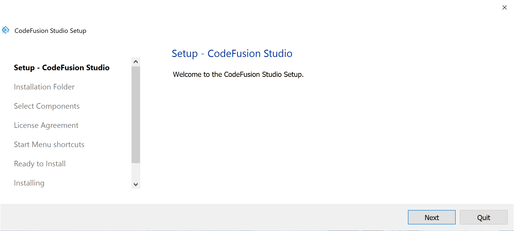
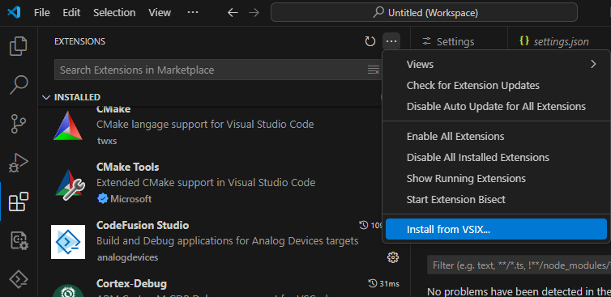

# Overview

Codefusion Studio (CFS) is an embedded software development platform based on Microsoft's Visual Studio Code (VS Code). Codefusion Studio provides best in class development tooling for embedded processors and MCUs by providing intuitive tools for newcomers while enabling advanced features for expert embedded developers.

## About CFS

- Homepage with quick access links for common tasks, links to articles and videos related to your projects, user guides, hardware reference manuals, data sheets, and other useful resources.
- A new project wizard for quickly creating projects as well as example applications to jumpstart your development.
- Tool chain support for building against ARM and RISC-V processors.
- Pin configuration tools for assigning signals to pins, configuring pin values such as input or output mode and power supply, viewing register details and values, and generating source code to be included in your project.
- Debugging features including breakpoints, disassembly, heterogeneous debug, etc.

## Supported Processors

CodeFusion Studio currently supports the following processors in the following configurations:

| Processor                                                    | MSDK | Zephyr | Config Tools |
| ------------------------------------------------------------ | ---- | ------ | ------------ |
| [MAX32655](https://www.analog.com/en/products/MAX32655.html) | Yes  | -      | -            |
| [MAX32662](https://www.analog.com/en/products/MAX32662.html) | Yes  | -      | -            |
| [MAX32670](https://www.analog.com/en/products/MAX32670.html) | Yes  | -      | -            |
| [MAX32672](https://www.analog.com/en/products/MAX32672.html) | Yes  | -      | -            |
| [MAX32675](https://www.analog.com/en/products/MAX32675.html) | Yes  | -      | -            |
| [MAX32690](https://www.analog.com/en/products/MAX32690.html) | Yes  | Yes    | Yes          |
| [MAX78000](https://www.analog.com/en/products/MAX78000.html) | Yes  | -      | -            |
| [MAX78002](https://www.analog.com/en/products/MAX78002.html) | Yes  | -      | Yes          |

## Install CFS

This section provides instructions for installing and setting up CodeFusion Studio for [supported processors](#supported-processors).

### Software Requirements

#### Dependencies

Tools VS Code extensions depend on:

- [Microsoft's Visual Studio Code](https://code.visualstudio.com/) version 1.89.0 or later.

#### Host OS Support

 CodeFusion Studio and extensions are supported on the following host operating systems:

- Windows 10 or 11 (64-bit)
- macOS (ARM64)
- Ubuntu 22.04 and later (64-bit)

#### Download CFS

1. Navigate to [CodeFusion Studio Installer Download](https://analog.com/CodeFusionStudio).
2. Download the desired installer file:

- Windows, download the **CodeFusionStudio\_\*.exe** installer.
- Linux, download the **CodeFusionStudio\_\*.run** installer.
- MacOS, download the **CodeFusionStudio\_\*.dmg** installer.

#### Install

⚠️
   The Linux installer downloads without execute permissions. Run `chmod a+x <installer>` to grant execute permissions before continuing.

1. Open the downloaded installer wizard to begin the installation process. 
2. Click **Next** to continue the setup.
3. Specify the folder destination for the install, and click **Next**.
4. Select the Default or desired components to install, and click **Next**.
5. Read the license agreement and click the box if you accept the license, then click **Next**.
6. Select the Start Menu in which to create a shortcut, and click **Next**.
7. Review setup selections and click **Install**.
8. Click **Finish** to close the installer.

### Set up CFS

#### Set CodeFusion Studio path

Specify your CodeFusion Studio installation path by selecting it from a list of detected installations.

⚠️
  Path can also be manually configured under user settings.

#### Set CFSUtil path

⚠️
  By default, the CFSUtil path points to `${config:cfs.sdk.path}/Utils/cfsutil/bin/cfsutil`.
  The default CFSUtil path should be sufficient in most cases.

Change your CFSUtil path if prompted or manually configure in user settings.

### Install the VS Code extension

⚠️
  The VS Code extensions should normally be installed from [VisualStudio Marketplace](https://marketplace.visualstudio.com/items?itemName=AnalogDevices.cfs-ide). This step is only required if you need to manually install an extension.

The CodeFusion Studio VS Code extensions can be found in the VS Code directory in the `CodeFusion Studio` installer.
To install the `*.vsix` file, open Visual Studio Code. From the `Extensions` tab, click `Install from VSIX...`  from the ellipses menu:

And browse to the desired *.vsix file(s) in your `<codefusion-sdk-install>/VSCode` directory.

- For the CodeFusion Studio IDE, select `cfs-ide-*.vsix`

### (Optional) Install Olimex ARM JTAG Drivers

The Olimex ARM-USB-OCD-H Debugging is required to debug the RISC-V core on the MAX part families. The Olimex drivers are not provided directly by CodeFusion Studio so need to be installed manually if RISC-V Debugging is required.

Download and installation instructions can be found in chapter 3 of the [:octicons-link-external-24: Olimex ARM-USB-OCD-h User Manual](https://www.olimex.com/Products/ARM/JTAG/_resources/ARM-USB-OCD_and_OCD_H_manual.pdf){:target="_blank"}

## Additional Documentation

For more documentation, refer to the Getting Started Guide for CodeFusion Studio.
